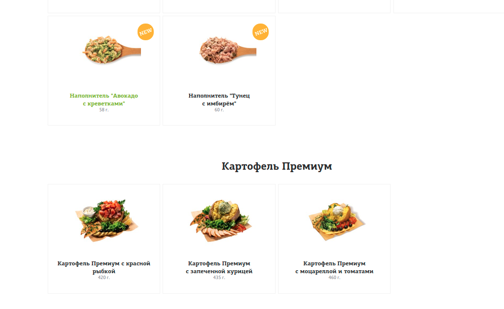
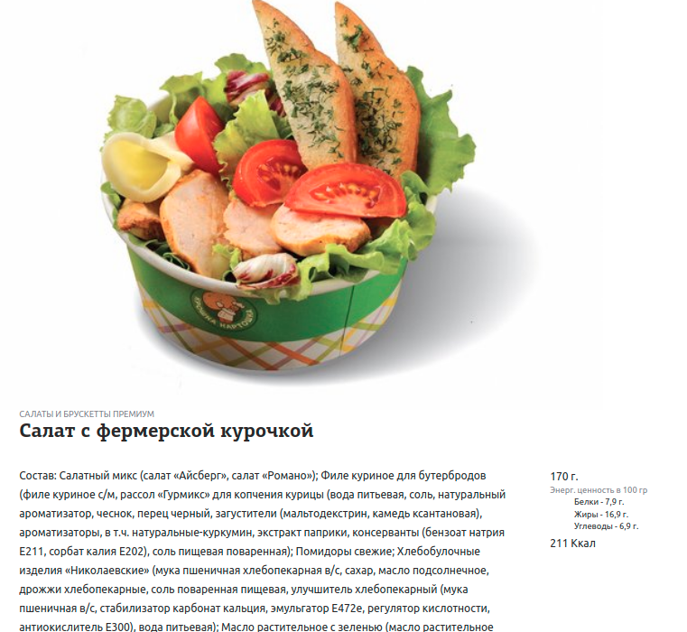
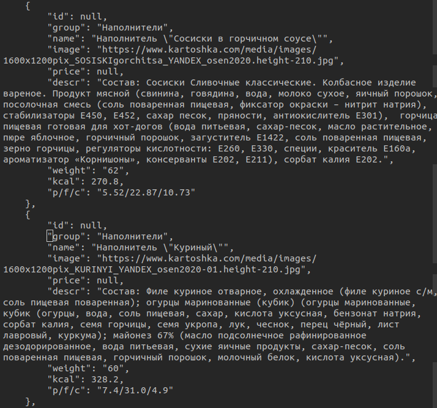

## [Kartoshka.com](https://www.kartoshka.com/menu/#!section=potatoes-xl)

Разрабатывали сайт-агрегатор, для всех мест где можно покушать или заказать еду.Предваритально надо было собрать всю информацию, чтобы потом занести в БД.

**Требовалось собрать**:
- Общее количество калорий
- белки, жиры, углеводы
- id товара
- категорию товара
- название товара
- ссылку на картинку
- цену
- описание
- вес

### Общий вид магазина

### Пример продукта

  

### Json файл

  

